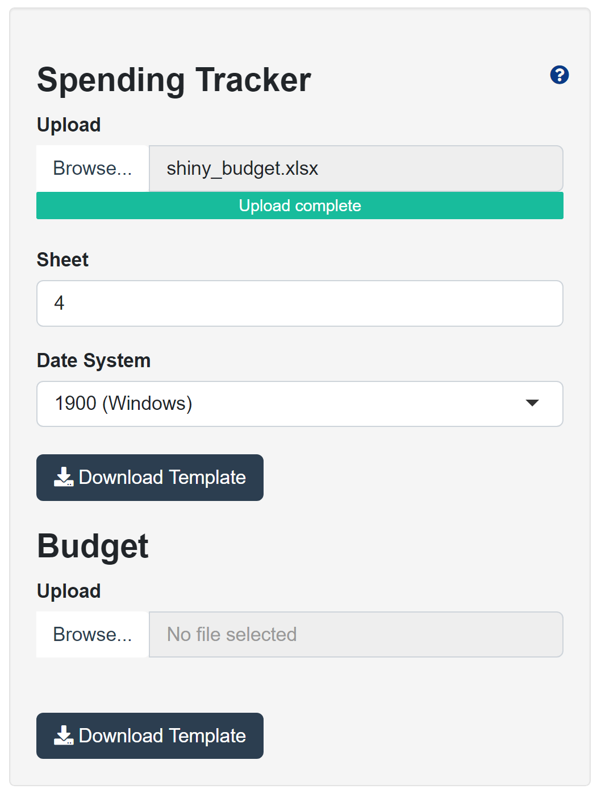

# Shiny Budget

A Shiny app for budgeting and keeping track of personal finances. 

## Overview

The first aim of this app is to provide a simple way to keep track of your spending. The **Spending Tracker** page includes plots to help you better understand your spending habits, which can in turn help build your budget. It looks like this:

The budget itself is very flexible. You decide on the categories and how much to set aside for each one, and the app shows you how you're doing:

New expenses can be added one at a time directly from within the app. They can also be uploaded in bulk as shown here:

Data is automatically saved between sessions, so no need to re-upload. 

The app includes built-in documentation, which can be accessed by clicking the question mark circle on each page. For example, here's the first one:

## Installation

The easiest way to install is by downloading the zipped program folder from this google drive [link](https://drive.google.com/drive/folders/15CkyY8tW26NCHrFT0iIcloUtxo4TiqDp?usp=sharing), which was created following the [DesktopDeployR](https://github.com/wleepang/DesktopDeployR) framework. Following the download, unzip in desired location and double-click on the **shiny_budget** file to launch. App should start in your browser. This method only works on Windows unfortunately.

Alternatively, you can clone this repo and run the app either in R Studio or directly from an R console with `shiny::runApp("PATH/TO/APP/", launch.browser=TRUE)`. The path should be the path to the folder containing `server.R` and `ui.R`. This does require installing the appropriate packages beforehand. To install packages, open R and run the following command: `install.packages(c("shiny", "shinyhelper", "data.table", "DT", "openxlsx", "magrittr", "shinydashboard", "dashboardthemes","ggplot2"))`. If you get an error from the `runApp` command because you don't have a launch browser set, try running `options(browser = 'firefox')`.

Happy Budgeting :) 
